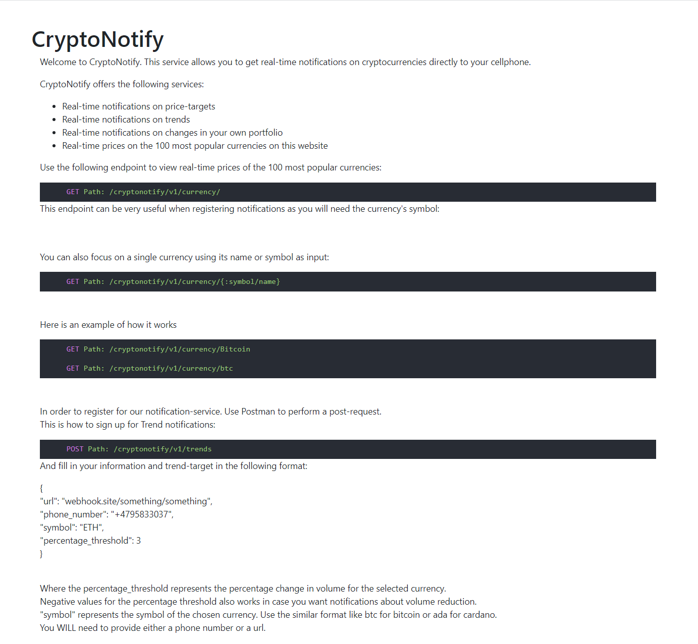
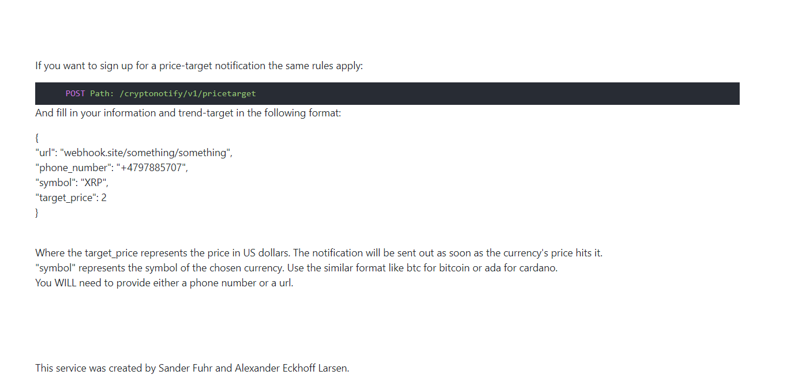
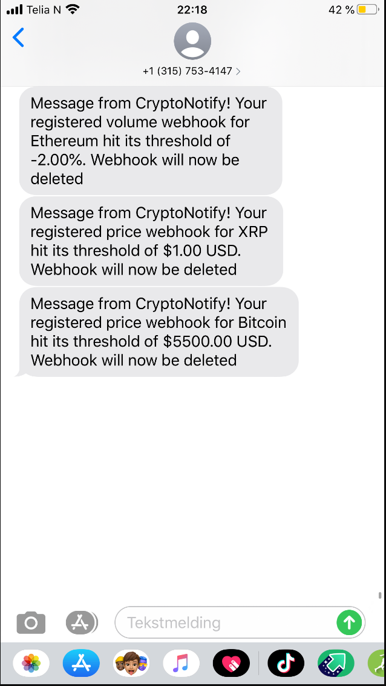

### Here is an example of how the notifications look on text-message:




# CryptoNotify

### Group members: Alexander Eckhoff Larsen & Sander Fuhr


## Openstack
An instance of the API can be found running at http://10.212.136.23:8080/ on Openstack:

[CryptoNotify](http://10.212.136.23:8080/ "CryptoNotify")

## Building / Running

```shell

cd group21-prog2005-project_cryptonotify
go run cmd/CryptoNotify.go
# Server now running at localhost:8080/, unless the PORT environment variable has been set.
```


## Endpoints
Four different endpoints in this api:

/cryptonotify/v1/currency/

/cryptonotify/v1/trends/

/cryptonotify/v1/pricetarget/

/cryptonotify/v1/portfolio/


### Currency
```
Format:

To get information about the 100 most popular currencies:
http://10.212.136.23:8080/cryptonotify/v1/currency/

To get specific information about 1 currency:
http://10.212.136.23:8080/cryptonotify/v1/currency/{currency_name/currency_symbol}
```

## Notifications

### The following endpoints allows for registration of notifications

Format for trends and price targets are described on the landing page and on the snapshots above.

POST request to http://10.212.136.23:8080/cryptonotify/v1/trends/ for registering notifications on trends

POST request to http://10.212.136.23:8080/cryptonotify/v1/pricetarget/ for registering notifications on price-targets

POST request to http://10.212.136.23:8080/cryptonotify/v1/portfolio/ for registering notifications on personal portfolio


### IMPORTANT! do not enter phone number for portfolio webhook. It works but we did not have time to implement the DELETE function, which means you will be spammed upon every timeout as long as the service runs.
format for registration of portfolio notifications is as following:

{

    "url": "https://webhook.site/something,
    
    "phone_number": "+4793044522",

    "symbols": ["ETH", "BTC", "XRP"],

    "holdings": [2, 1, 30],

    "timeout": 30
}

Where symbols are the symbols of your currencies and holdings are the amount of them. Floats can also be utilized here if you hold 
fragments of a coin. Timeout is the frequency in seconds of how often you want notifications. You will need to provide a url or a phone number in order to get your notifications.


### The following endpoints allows for viewing registered notifications

GET request to http://10.212.136.23:8080/cryptonotify/v1/trends/ for showing all registered trends webhooks

GET request to http://10.212.136.23:8080/cryptonotify/v1/trends/{id}  for showing one registered trend webhook


GET request to http://10.212.136.23:8080/cryptonotify/v1/pricetarget/ for showing all registered price-target webhooks

GET request to http://10.212.136.23:8080/cryptonotify/v1/pricetarget/{id}  for showing one registered price-target webhook


GET request to http://10.212.136.23:8080/cryptonotify/v1/portfolio/ for showing all registered portfolio webhooks

GET request to http://10.212.136.23:8080/cryptonotify/v1/portfolio/{id}  for showing one registered portfolio webhook


### The following endpoints allows for deletion of notifications

DELETE method  http://10.212.136.23:8080/cryptonotify/v1/trends/{id} for deletion of  trend webhooks

DELETE method  http://10.212.136.23:8080/cryptonotify/v1/pricetarget/{id}  for deletion of price-target webhooks

DELETE method  http://10.212.136.23:8080/cryptonotify/v1/portfolio/{id} for deletion of portfolio webhooks


## Original project plan
Our initial plan was to focus this service on the ability of identifying arbitrage possibilities within the cryptocurrency realm,
however Coinmarketcap charged 299 USD for this info, and we were not able to find any other APIs which provided this service. 
Therefore our service focuses mainly on notifications involving volume increases/decreases (trends), price targets and portfolio management.

## What went well and what went wrong?
The biggest problem we had was with the external services such as coinmarketcap's API wich charged 299 USD for the information we wanted to get our hands on. 
Another problem was with the text-message service. We had to spit in about 20 USD in total in order for it to work as we wanted but that was a feature we felt was worth the price.
Other than that we feel that the workflow worked great. We spent a lot of time thinking about how we wanted to structure the service and poking around different API's to find the best options.
Because of this we got a bit late start on the coding itself but we feel like we managed to implement evrything we wanted aside from the arbitrage. The API we used had a limit on how many reads we could do so we mocked the entire service while developing. This turned out to be extremely helpful.


## The hard aspects of the project
The hard parts of the project has already been described but to summarize: Problems with the API, no free text-message provider and time-management.

## What new has the group learned?
The group has become more efficient in the general curriculum of the course and examples of this is working with external services, programming in golang and the use of features like webhooks and caching. We have also learned to start EVEN earlier organizing ourselves.

## Total work hours
We estimate that we have spent about 80 hours in total on this project. This is equally divided by the 2 members that the group consists of.
The time estimate includes stuff like organizing the project, searching for good external services, poking around the API's and the actual coding of the service.


